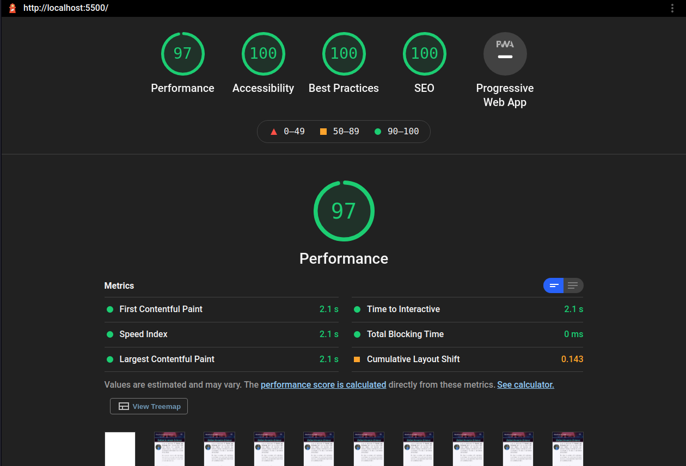

# RafaelAugustScherer.github.io
Welcome to my Web Portfolio (Beta)!

This is a page that contains a brief description of myself, my experience and some of my projects. I will be constantly updating the page and adding new features as well (list below).

## Features
- [X] Profile Section
- [X] Contact Section
- [X] Outrun background
- [X] Academic & Professional Experiences
- [X] Dark Theme
- [X] Portuguese Translation

## Lighthouse Report

## Mini Projects Made on Trybe
### JavaScript & DOM
* https://rafaelaugustscherer.github.io/trybeProjects/block05/pixels-art  
* https://rafaelaugustscherer.github.io/trybeProjects/block05/todo-list  
* https://rafaelaugustscherer.github.io/trybeProjects/block05/meme-generator  
* https://rafaelaugustscherer.github.io/trybeProjects/block05/color-guess    
* https://rafaelaugustscherer.github.io/trybeProjects/block05/mistery-letter  
* https://rafaelaugustscherer.github.io/trybeProjects/block06/trybewarts  
* https://rafaelaugustscherer.github.io/trybeProjects/block09/shopping-cart

### React
* https://rafaelaugustscherer.github.io/trybeProjects/block10/movie-cards-library
* https://rafaelaugustscherer.github.io/trybeProjects/block11/tryunfo

### React Router

* Block 12: https://trybetunes.logy.surge.sh/
* Block 13: https://frontend-online-store.logy.surge.sh/

### Redux

* Block 15: https://trybewallet.logy.surge.sh/

### Context API

* Block 18: https://rafaelaugustscherer.github.io/recipes-app/
